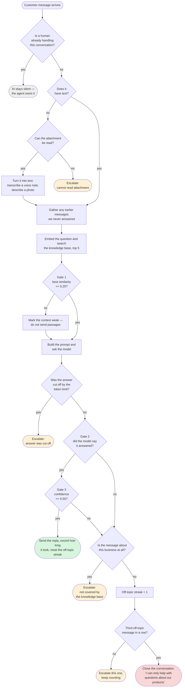

# Activity diagram — the AI decision

What the AI decides for each customer message, with every gate as a decision node. The
[sequence diagram](../sequence-diagram/) shows *who* does what in what order; this shows *why*
one message gets an answer and another gets a person.

Semester 1 produced no activity diagram, so there is nothing to compare this against.

<!-- images -->

*Rendered from the Mermaid source below.*

## The decisions worth defending

**Three gates, not one.** The Semester 1 design had a single test — confidence below 70%.
Three were needed, because they fail for different reasons:

1. **Similarity** is checked before the model is called, so a question the knowledge base
   cannot possibly answer costs nothing.
2. **The model's own verdict** — it is asked whether the retrieved passages actually answer
   the question, and told that declining is a correct outcome. A passage can be about the
   right topic and still not contain the answer, and only reading it can tell.
3. **Confidence**, below which the answer is not sent.

**"Is it about this business at all?" is a separate question from "can I answer it?"** This is
the branch that matters most. Weak retrieval used to be treated as proof a message was
off-topic, so a question about a product the knowledge base did not cover was counted against
the customer — and three of those closed the conversation as spam. That happened to a real
customer asking about ear buds. The model now judges relatedness separately, and the flag
defaults to *related* when it is missing: a needless handover costs an agent a minute, while
the other mistake shuts the door on someone who wanted to buy something.

**Silence is a valid outcome.** When an agent already owns the conversation the AI does not
speak at all. Note that escalation alone does not silence it — a customer who keeps typing
after a handover still gets answered, which is why the check is "is a human handling this",
not "has this ever been escalated".

## Thresholds

All three are configuration, not constants, so they can be tuned without a rebuild:

| Gate | Property | Default |
| :--- | :--- | :--- |
| Retrieval similarity | `app.ai.min-similarity` | 0.25 |
| Model confidence | `app.ai.min-confidence` | 0.55 |
| Off-topic messages before closing | `app.ai.off-topic-limit` | 3 |
| Passages retrieved | `app.ai.top-k` | 5 |
