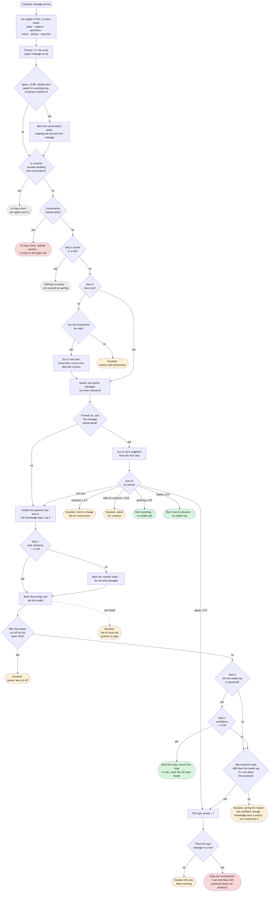

# Activity diagram — the AI decision

What the AI decides for each customer message, with every gate as a decision node. The
[sequence diagram](../sequence-diagram/) shows *who* does what in what order; this shows *why*
one message gets an answer and another gets a person.

Semester 1 produced no activity diagram, so there is nothing to compare this against.

<!-- images -->

*Rendered from the Mermaid source below.*

```mermaid
flowchart TD
    start(["Customer message arrives"]) --> judge["Jev judges it first, in every mode:<br/>spam · urgency · sentiment ·<br/>intent · person · injection"]
    judge --> prio["Priority 1–3: the most<br/>urgent message so far"]
    prio --> isSpam{"Spam ≥ 0.88, nobody here<br/>asked for anything real,<br/>no person cleared it?"}
    isSpam -->|yes| markSpam["Mark the conversation spam,<br/>keeping the kind and the message"]
    isSpam -->|no| owned
    markSpam --> owned{"Is a human<br/>already handling<br/>this conversation?"}
    owned -->|yes| quiet(["AI stays silent —<br/>the agent owns it"])
    owned -->|no| spamGate{"Conversation<br/>marked spam?"}
    spamGate -->|yes| quietSpam(["AI stays silent, nobody alerted —<br/>it waits in the Spam tab"])
    spamGate -->|no| sticker{"Only a sticker<br/>or a like?"}
    sticker -->|yes| quietSticker(["Nothing to answer —<br/>not counted as waiting"])
    sticker -->|no| hasText{"Does it<br/>have text?"}

    hasText -->|no| readable{"Can the attachment<br/>be read?"}
    readable -->|yes| toText["Turn it into text:<br/>transcribe a voice note,<br/>describe a photo"]
    readable -->|no| escUnreadable(["Escalate:<br/>cannot read attachment"])
    toText --> gather

    hasText -->|yes| gather["Gather any earlier messages<br/>we never answered"]
    gather --> fw{"Firewall on, and<br/>this message<br/>stands alone?"}
    fw -->|no| retrieve
    fw -->|yes| jev["Act on Jev's judgment<br/>from the first step"]
    jev --> sure{"Sure of<br/>an action?"}
    sure -->|"injection ≥ 0.7"| escInj(["Escalate: tried to change<br/>the AI's instructions"])
    sure -->|"asks for a person ≥ 0.65"| escHuman(["Escalate: asked<br/>for a person"])
    sure -->|"greeting ≥ 0.9"| greet(["Short greeting —<br/>no model call"])
    sure -->|"thanks ≥ 0.9"| thank(["Short 'you're welcome' —<br/>no model call"])
    sure -->|"abuse ≥ 0.9"| streak
    sure -->|"not sure"| retrieve["Embed the question and search<br/>the knowledge base, top 5"]

    retrieve --> gate1{"Gate 1<br/>best similarity<br/>>= 0.25?"}
    gate1 -->|no| weak["Mark the context weak —<br/>do not send passages"]
    gate1 -->|yes| prompt["Build the prompt and<br/>ask the model"]
    weak --> prompt

    prompt --> cut{"Was the answer<br/>cut off by the<br/>token limit?"}
    prompt -.->|"call failed"| escFail(["Escalate:<br/>the AI could not<br/>produce a reply"])
    cut -->|yes| escCut(["Escalate:<br/>answer was cut off"])

    cut -->|no| gate2{"Gate 2<br/>did the model say<br/>it answered?"}
    gate2 -->|yes| gate3{"Gate 3<br/>confidence<br/>>= 0.55?"}
    gate3 -->|yes| send(["Send the reply, record how long<br/>it took, reset the off-topic streak"])

    gate2 -->|no| related{"Was retrieval weak<br/>AND does the model say<br/>it is not about<br/>this business?"}
    gate3 -->|no| related

    related -->|no| escNoAnswer(["Escalate, giving the reason:<br/>not confident enough ·<br/>knowledge base is empty ·<br/>not covered by it"])
    related -->|yes| streak["Off-topic streak + 1"]

    streak --> third{"Third off-topic<br/>message in a row?"}
    third -->|no| escQuiet(["Escalate this one,<br/>keep counting"])
    third -->|yes| close(["Close the conversation:<br/>'I can only help with<br/>questions about our products'"])

    style quiet fill:#eee
    style quietSticker fill:#eee
    style quietSpam fill:#f9d7d7
    style greet fill:#d7f5dd
    style thank fill:#d7f5dd
    style escInj fill:#fdf0d5
    style escHuman fill:#fdf0d5
    style send fill:#d7f5dd
    style close fill:#f9d7d7
    style escUnreadable fill:#fdf0d5
    style escCut fill:#fdf0d5
    style escFail fill:#fdf0d5
    style escNoAnswer fill:#fdf0d5
    style escQuiet fill:#fdf0d5
```

## The decisions worth defending

**Three gates, not one.** The Semester 1 design had a single test — confidence below 70%.
Three were needed, because they fail for different reasons:

1. **Similarity** decides what the model is given, not whether it is asked. Below 0.25 the
   passages are dropped as irrelevant and the model answers without them — which is how a
   "hello" gets a greeting instead of an escalation: a greeting matches no policy document
   well, so escalating on weak retrieval alone would hand every one of them to a person.
2. **The model's own verdict** — it is asked whether the retrieved passages actually answer
   the question, and told that declining is a correct outcome. A passage can be about the
   right topic and still not contain the answer, and only reading it can tell.
3. **Confidence**, below which the answer is not sent.

**"Is it about this business at all?" is a separate question from "can I answer it?"** This is
the branch that matters most. Weak retrieval used to be treated as proof a message was
off-topic, so a question about a product the knowledge base did not cover was counted against
the customer — and three of those closed the conversation as spam. That happened to a real
customer asking about ear buds. Now it takes **both**: retrieval must be weak *and* the model
must judge the message unrelated. Strong retrieval with a decline is a real question the
knowledge base answers badly, so it goes to a person. The `related` flag also defaults to
*related* when the model omits it: a needless handover costs an agent a minute, while the
other mistake shuts the door on someone who wanted to buy something.

**Every escalation says why.** The agent sees one of nine reasons: the attachment could not be
read, the message tried to change the AI's instructions, the customer asked for a person,
the model call failed, the answer was cut off, the AI was not confident enough, the
knowledge base is empty, the question is not covered by it, or the message is not about the
business. Each points at a different fix — upload a document, check the model is running,
raise the token limit, or nothing at all.

**The firewall only removes work.** With `TRIAGE_MODE=on`, a Jev decision settles what needs
no generation — a greeting, a thank-you, a request for a person, an injection attempt, plain
abuse — before the model is called. Anything it is not sure of takes the path below exactly as
before, and it stands down when earlier messages are still waiting: "hello" after an unanswered
"delivery cost?" is a question owed an answer, not a greeting. It never acts on "off-topic":
relatedness is judged against the real knowledge base further down, and closing a real
customer's conversation is the mistake worth never making. Measured thresholds and results are
in [`docs/jev-firewall.md`](../../../jev-firewall.md).

**Spam is decided per conversation, and a real customer always wins.** A message Jev is at
least 88% sure is spam flags the conversation — but only if nobody in it has asked the
business for anything real. A customer who asked about delivery and then sent "asdf" is still a
customer; a conversation flagged earlier returns to Active the moment its customer asks for
something; and once a person says "not spam" it is never flagged automatically again. Spam
gets no reply and no alert, because answering tells a bot the page is live and escalating puts
it in front of a person.

**A sticker asks nothing.** A Messenger "like" is a sticker: it is shown, not answered, and it
does not count the conversation as waiting for a reply.

**Silence is a valid outcome.** When an agent already owns the conversation the AI does not
speak at all. Note that escalation alone does not silence it — a customer who keeps typing
after a handover still gets answered, which is why the check is "is a human handling this",
not "has this ever been escalated".

## Thresholds

The thresholds are configuration, not constants, so they can be tuned without a
rebuild:

| Gate | Property | Default |
| :--- | :--- | :--- |
| Retrieval similarity | `app.ai.min-similarity` | 0.25 |
| Model confidence | `app.ai.min-confidence` | 0.55 |
| Off-topic messages before closing | `app.ai.off-topic-limit` | 3 |
| Firewall mode | `app.triage.mode` | shadow |
| Firewall — injection attempt | `app.triage.injection-threshold` | 0.7 |
| Firewall — asks for a person | `app.triage.human-threshold` | 0.65 |
| Firewall — greeting, thanks, abuse | `app.triage.intent-threshold` | 0.9 |
| Spam | `app.triage.spam-threshold` | 0.88 |

The number of passages retrieved for a reply is **fixed at 5** (`KNOWLEDGE_PASSAGES` in
`AiReplyService`). `app.ai.top-k` looks as if it controls this but does not: it only sets the
default for the knowledge page's "test what the AI would retrieve" tool.
