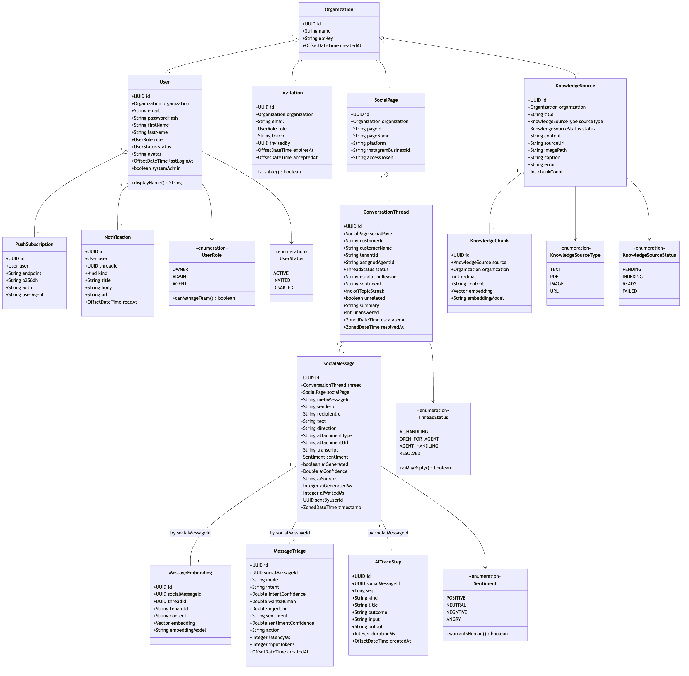
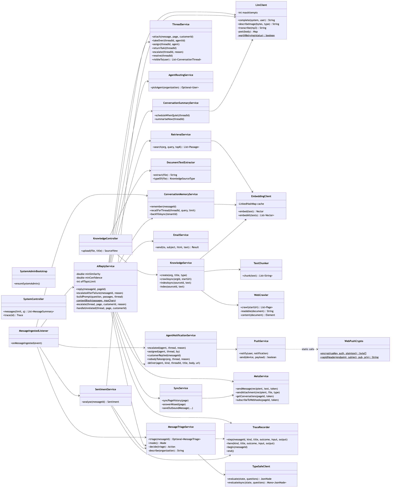
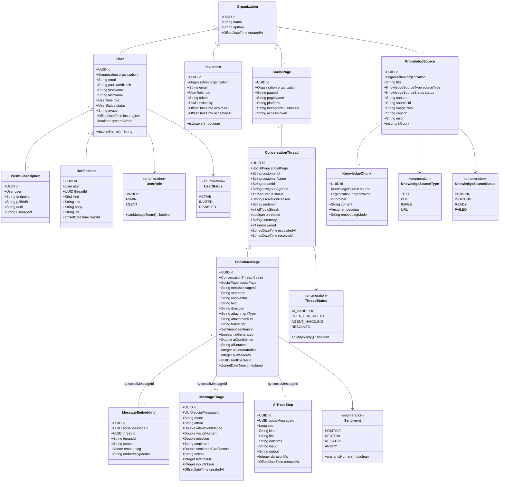
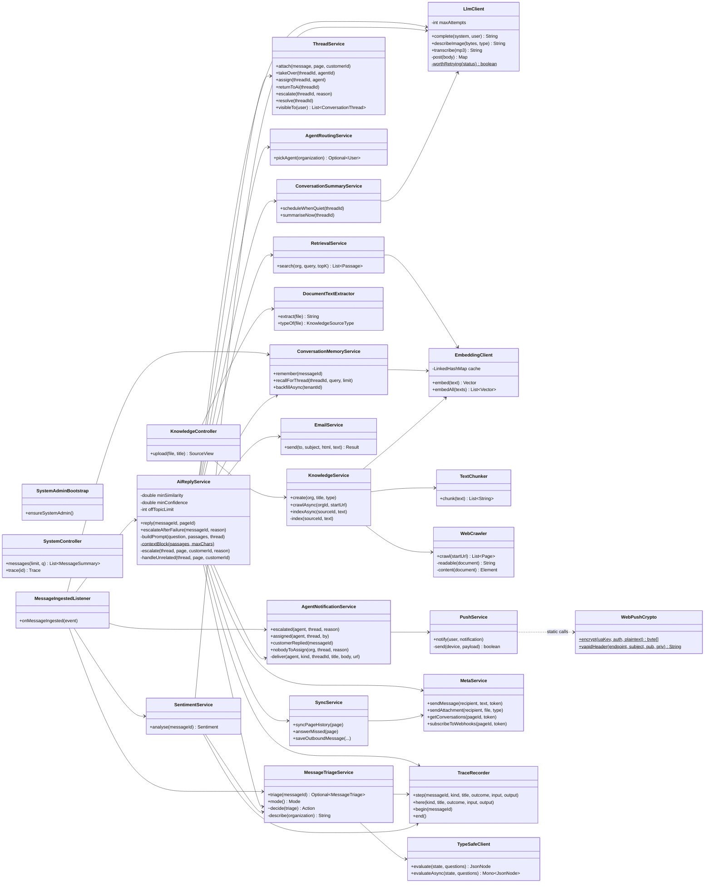

# Class diagram — Semester 2

Two views: the domain model, then the services that act on it. Compare with the
[reconstructed Semester 1 class diagram](../../old-system-design/class-diagram/).

<!-- images -->

*Rendered from the Mermaid source below.*

## 1. Domain model

> `embedding` is declared `Vector` above for diagram clarity. The Java type is `float[]`,
> mapped by Hibernate to a pgvector `vector(1536)` column with
> `@JdbcTypeCode(SqlTypes.VECTOR)` and `@Array(length = 1536)`.

### The behaviour on the enums is the part worth reading

`ThreadStatus.aiMayReply()` returns true for `AI_HANDLING` **and** `OPEN_FOR_AGENT`. That
looks like a bug and is not: when the AI escalates, the customer is still there and may keep
typing. If escalation silenced the AI, one weak question would mute the bot for the rest of
the conversation — which is exactly what happened before this was fixed.

`UserRole.canManageTeam()` is the single authorisation predicate for OWNER and ADMIN, used by
every endpoint that invites, removes, reassigns or edits the knowledge base.

`Sentiment.warrantsHuman()` is true only for `ANGRY`, deliberately distinct from `NEGATIVE` —
"my parcel is late" is negative and answerable; abuse is not.

## 2. Service layer

### Notes for redrawing

- `AiReplyService` is the decision engine, not a thin wrapper. The three gates, the escalation
  reasons, the off-topic streak and the prompt all live there, which is why it is the largest
  class in the project.
- `LlmClient` is deliberately thin — it knows how to get text out of a model and nothing about
  the product. It retries transient provider failures, and refuses to retry timeouts or bad
  requests.
- `WebPushCrypto` is static and pure, so it can be tested against RFC 8291's published worked
  example rather than by hoping.
- `MessageIngestedListener` is where the asynchronous boundary sits — see the
  [level 1 data flow diagram](../workflow-diagram/Level%201%20Data%20Flow%20Diagram/).

### Against Semester 1

The old design had five backend components and no domain behaviour at all. The two additions
that matter are `ConversationThread` with its status machine, which did not exist as a concept,
and the split of "Knowledge Engine / RAG" into an **ingestion** path (source → chunker →
embeddings) and a **retrieval** path (query → embedding → nearest neighbour → prompt), which
turn out to be different problems with different failure modes.
