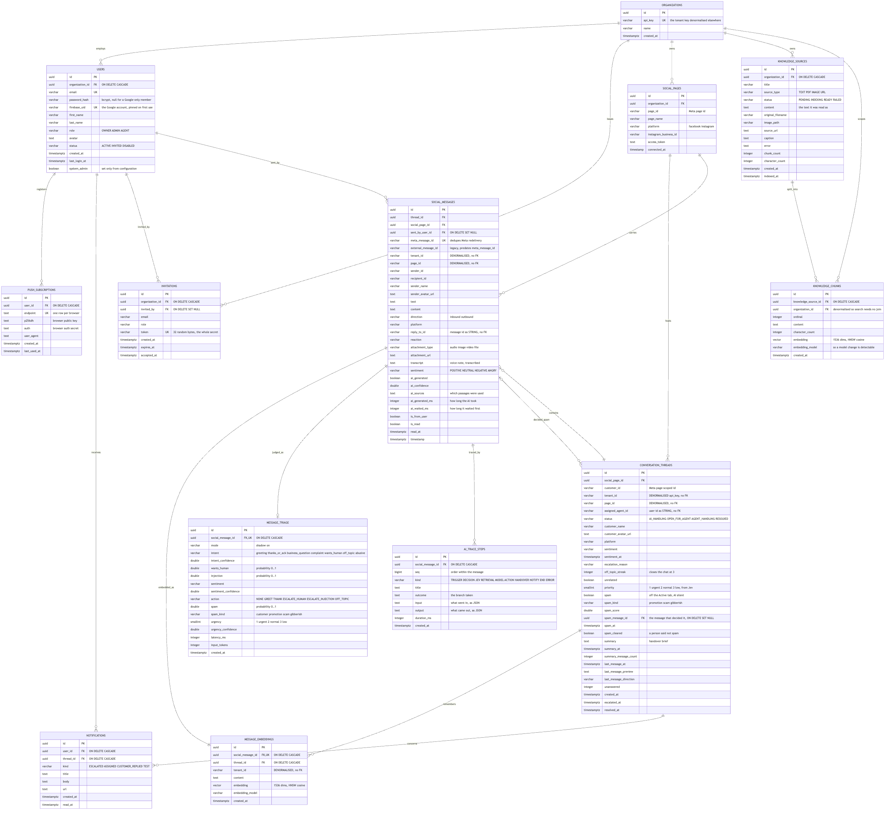
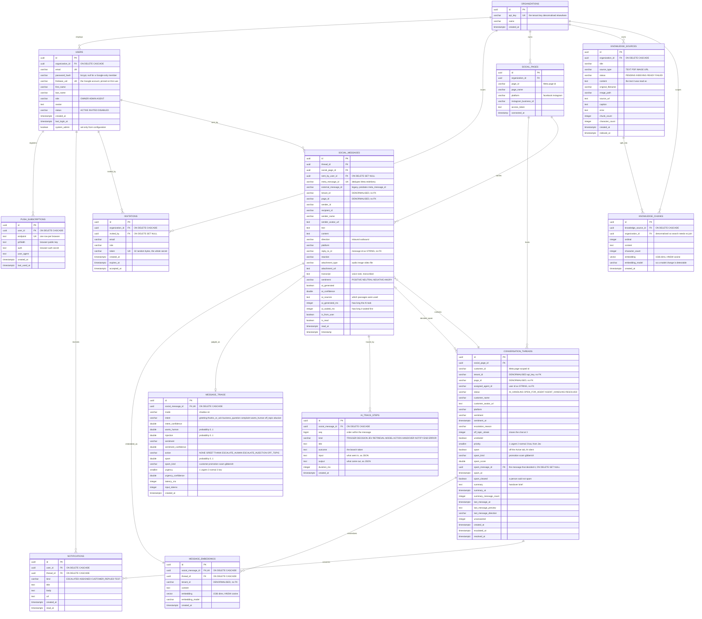

# ER diagram — Semester 2

Thirteen tables, produced by 24 Flyway migrations. Verified against the running database, not
from memory. Compare with [Semester 1](../../old-system-design/er-diagram/Picture1.png), which
had six.

<!-- images -->

*Rendered from the Mermaid source below.*

## Four properties worth defending in a viva

**1. Embeddings live in the database.** `knowledge_chunks.embedding` and
`message_embeddings.embedding` are `vector(1536)` columns provided by the pgvector extension,
each with an **HNSW index using `vector_cosine_ops`**. HNSW rather than IVFFlat because
IVFFlat must be trained on existing rows, and there are none when a migration runs — it would
build a useless index that had to be rebuilt after loading.

**2. Some "relationships" are deliberately not foreign keys.** `tenant_id` on threads,
messages and embeddings is the organisation's api-key as a *string*. So is `page_id`, and so
is `assigned_agent_id`, which points at a user without a constraint. This is inherited from
the pre-authentication schema, where a tenant was a string in a URL. It is honest to draw it
as it is: the tenant filter works, but the database does not enforce it, and that is a
weakness worth naming rather than hiding.

**3. Two partial unique indexes do real work.**

- `uk_thread_active` on `(social_page_id, customer_id) WHERE status <> 'RESOLVED'` — a
  customer may have exactly one live conversation, while every resolved one stays as history.
  A plain unique index would have made closing a conversation impossible to do twice.
- `uk_knowledge_source_url` on `(organization_id, source_url) WHERE source_url IS NOT NULL` —
  re-crawling a website updates each page instead of duplicating it.

**4. Cascade lives in SQL, not in JPA.** There is no `@OneToMany`, no `cascade` and no
`orphanRemoval` anywhere in the entity model; every association is a lazy `@ManyToOne` from
the child. Deletion is `ON DELETE CASCADE` in the schema. That is what makes removing a
knowledge source a single transaction that takes its vectors with it.

**5. A thread and a message point at each other.** A message belongs to a thread, and a thread
flagged as spam points back at the message that decided it (`spam_message_id`). The back
reference is `ON DELETE SET NULL`, not cascade: deleting a message must not delete the
conversation it was in, only the evidence for one judgment about it.

## Against Semester 1

The old model had `TENANTS`, `ROLES`, `USERS`, `SOCIAL_PAGES`, `KNOWLEDGE_DOCUMENTS` and
`SOCIAL_MESSAGES`, all with integer ids. Five changes matter:

| Then | Now |
| :--- | :--- |
| `ROLES` table joined to users | `role` column constrained to three values — roles are fixed, not data |
| `KNOWLEDGE_DOCUMENTS.content varchar(5000)` | a source plus its chunks, each with a vector and an indexing status |
| no conversation table | `conversation_threads`, and it is the busiest table in the schema |
| messages hang off page and tenant | messages hang off a thread, which is what makes a handover possible |
| integer surrogate keys | UUIDs, so ids are not guessable in a URL |
