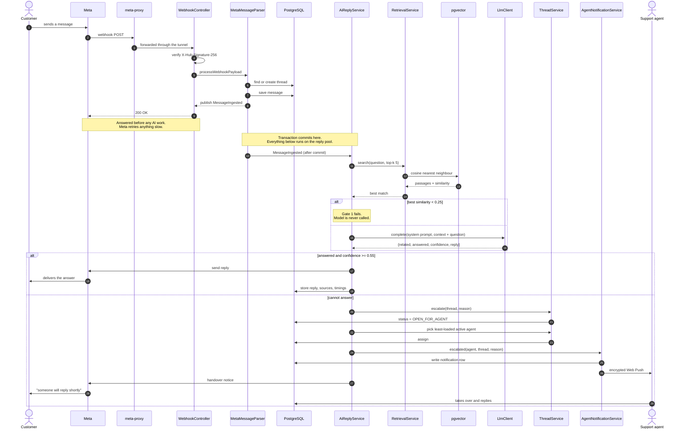

# Sequence diagram — reply or escalate

The path a customer's message takes, in order, from Messenger to either an AI answer or a
human being alerted. This is the behaviour the project is named for, and the one
[`docs/FINAL_REPORT.md`](../../../FINAL_REPORT.md) §6 asks for by name.

Semester 1 produced no sequence diagram, so there is nothing to compare this against.

<!-- images -->

*Rendered from the Mermaid source below.*

## What this shows that the data flow diagrams cannot

**Meta is answered first, in step 10.** The webhook returns `200 OK` before a single line of AI
work happens. Meta retries anything it considers slow, and a retry would mean the customer
being answered twice. A DFD has no way to express "this happens before that".

**The transaction boundary.** The event is published *inside* the ingesting transaction but
handled only after it commits, on a different thread pool. An earlier version called the AI
directly from the ingestion path, and it looked up a message the committing transaction had
not released yet — so it silently did nothing.

**Gate 1 short-circuits the model.** When nothing in the knowledge base comes close, the model
is never called at all. That is deliberate: an off-topic question should cost nothing.

**The escalation branch is seven steps, not one.** Escalating means changing thread state,
choosing an agent by current load, writing a notification row, pushing to that agent's
devices, *and* telling the customer someone is coming — because a conversation that goes quiet
after "let me check" is worse than no promise at all.

## Matching the code

| Diagram step | Source |
| :--- | :--- |
| Signature verification, then 200 | `WebhookController.handleWebhook` |
| Thread attach before save | `MetaMessageParser.saveMessage` → `ThreadService.attach` |
| Event after commit | `MessageIngested` + `MessageIngestedListener` |
| Gate 1 at 0.25 | `app.ai.min-similarity` |
| Gate 3 at 0.55 | `app.ai.min-confidence` |
| Least-loaded assignment | `AgentRoutingService.pickAgent` |
| Notification row then push | `AgentNotificationService.deliver` |
