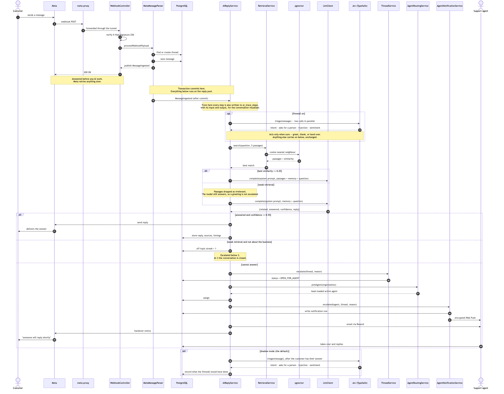
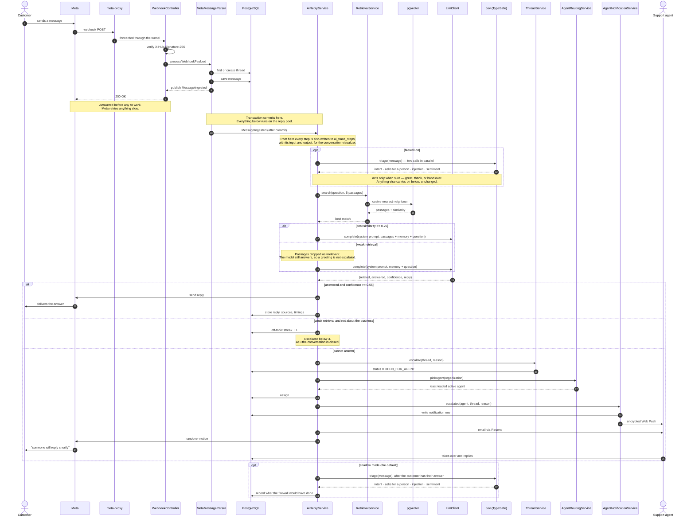

# Sequence diagram — reply or escalate

The path a customer's message takes, in order, from Messenger to either an AI answer or a
human being alerted. This is the behaviour the project is named for, and the one
[`docs/FINAL_REPORT.md`](../../../FINAL_REPORT.md) §6 asks for by name.

Semester 1 produced no sequence diagram, so there is nothing to compare this against.

<!-- images -->

*Rendered from the Mermaid source below.*

## What this shows that the data flow diagrams cannot

**Meta is answered first, in step 9.** The webhook returns `200 OK` before a single line of AI
work happens. Meta retries anything it considers slow, and a retry would mean the customer
being answered twice. A DFD has no way to express "this happens before that".

**The transaction boundary.** The event is published *inside* the ingesting transaction but
handled only after it commits, on a different thread pool. An earlier version called the AI
directly from the ingestion path, and it looked up a message the committing transaction had
not released yet — so it silently did nothing.

**Gate 1 changes what the model is given, not whether it is asked.** When nothing in the
knowledge base comes close, the passages are dropped and the model answers from the question
and conversation memory alone. Escalating on weak retrieval by itself would hand every
"hello" to a person, since a greeting matches no policy document well.

**The firewall sits before the model, and only acts when sure.** In `on` mode one Jev
decision settles greetings, thanks, requests for a person and injection attempts before
anything is generated; everything it is unsure of runs down the path below exactly as before.
In shadow mode — the default — the same judgment is made *after* the customer has been
answered, and only recorded, so the evaluation can never slow a reply.

**Escalation is a dozen steps, not one.** Escalating means changing thread state, choosing an
agent by current load, recording the assignment, writing a notification row, pushing to that
agent's devices, emailing them, *and* telling the customer someone is coming — because a
conversation that goes quiet after "let me check" is worse than no promise at all.

## Matching the code

| Diagram step | Source |
| :--- | :--- |
| Signature verification, then 200 | `WebhookController.handleWebhook` |
| Thread attach before save | `MetaMessageParser.saveMessage` → `ThreadService.attach` |
| Event after commit | `MessageIngested` + `MessageIngestedListener` |
| Gate 1 at 0.25 | `app.ai.min-similarity` |
| Gate 3 at 0.55 | `app.ai.min-confidence` |
| Weak retrieval still calls the model | `AiReplyService.reply` — `weakContext` |
| Off-topic streak, closed at 3 | `AiReplyService.handleUnrelated` |
| Least-loaded assignment | `AgentRoutingService.pickAgent` |
| Email to the agent | `AiReplyService.notifyAssignee` → Resend |
| Firewall, on mode | `AiReplyService.firewall` → `MessageTriageService.triage` |
| Firewall, shadow mode | `MessageIngestedListener`, after the reply |
| Notification row then push | `AgentNotificationService.deliver` |
