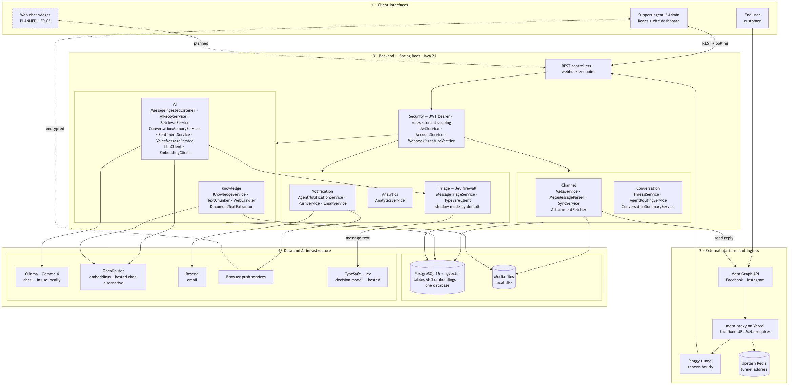
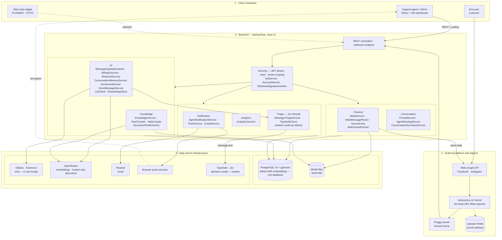

# System architecture — Semester 2

Compare with [Semester 1](../../old-system-design/system-architecture/Picture1.png). The four
layers are kept in the same order so the two can be read side by side.

<!-- images -->

*Rendered from the Mermaid source below.*

## The three substitutions from Semester 1

**pgvector replaces Pinecone, and it is inside the database.** The old diagram had a separate
Pinecone box beside PostgreSQL. There is now one box, because the chunk text and its 1536-
dimension embedding are columns of the same row. Deleting a knowledge source deletes its
vectors by `ON DELETE CASCADE`, in the same transaction — so the bot cannot answer from
material an admin removed, which is a GDPR question the old two-store design answered badly.

**Web Push replaces Firebase Cloud Messaging.** Same reach, no Google project, and the
notification body is encrypted against keys the browser generated, so the push service
relaying a customer's name and question cannot read either.

**The chat model moved to the machine.** `AI_CHAT_PROVIDER` is one switch that sets four
things together — base URL, model, token budget and timeout — because changing only the URL is
how you end up pointing at a local model with a 20-second timeout and escalating every reply.
Embeddings deliberately stay hosted: the schema declares `vector(1536)`, so a different
embedding model would mean a migration and a full re-index.

## The ingress chain, which Semester 1 did not model

Meta requires one fixed URL for webhooks and OAuth redirects. A free tunnel to a development
machine gets a new hostname roughly every hour. The proxy on Vercel holds the stable address
that is registered with Meta once, looks up the current tunnel in Redis, and forwards. Redis
rather than memory, because a serverless function loses memory on every cold start.

This is development scaffolding, not product architecture — in deployment the backend has its
own address and the proxy disappears. It is drawn because it is real, and because a marker
running the project will meet it.

## Transport: polling, not websockets

The Semester 1 diagram labelled the dashboard link "WebSocket / REST". No websockets were
built. The dashboard polls — messages and threads every 1.5s, connection status every 5s, a
Meta sync every 10s, and the notification bell every 15s.

The sync is **triggered by the dashboard**, not scheduled on the server: there is no
`@Scheduled` job anywhere in the backend. While nobody has the dashboard open, a message Meta
failed to deliver by webhook is not fetched, and so not answered, until someone opens it.

That is a real limitation and worth stating plainly: it costs requests that a socket would not,
and it bounds how fresh the inbox can be. It is also why the sync was made cheap enough to run
three times a minute without the server noticing.
