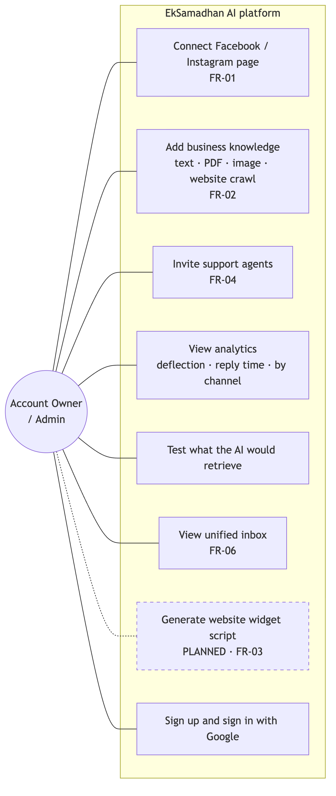
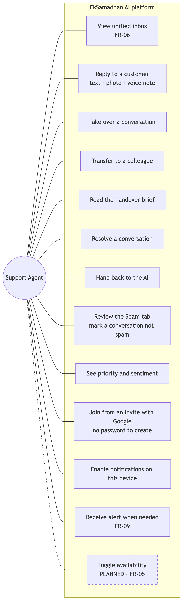
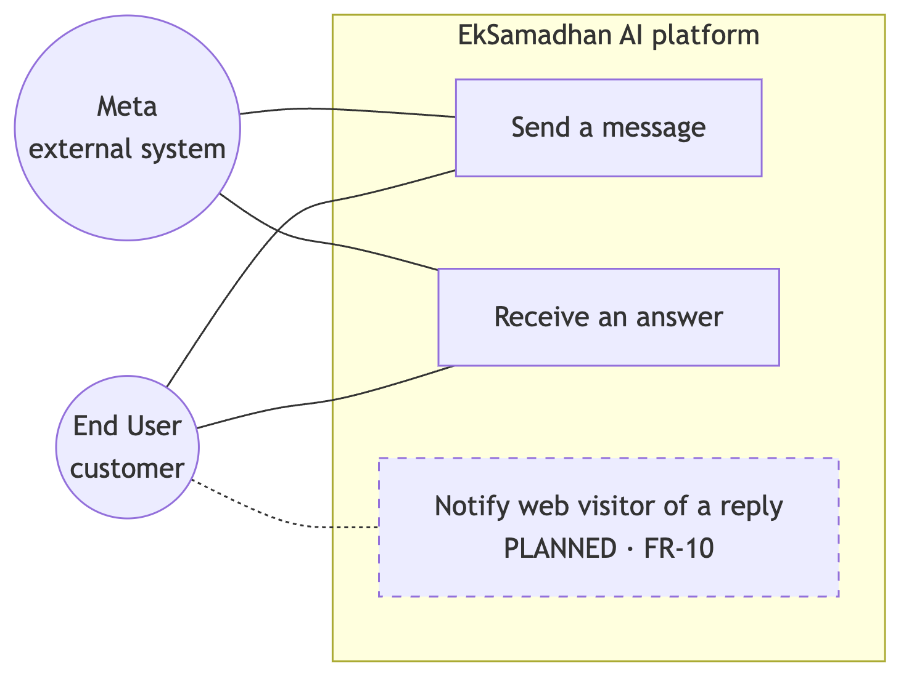
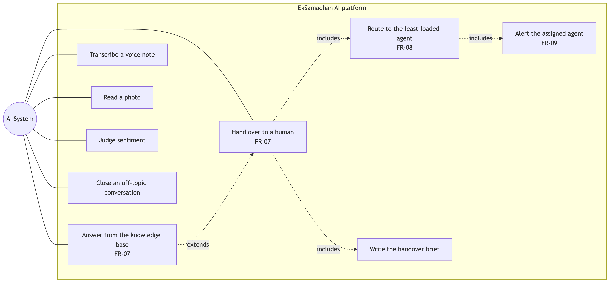
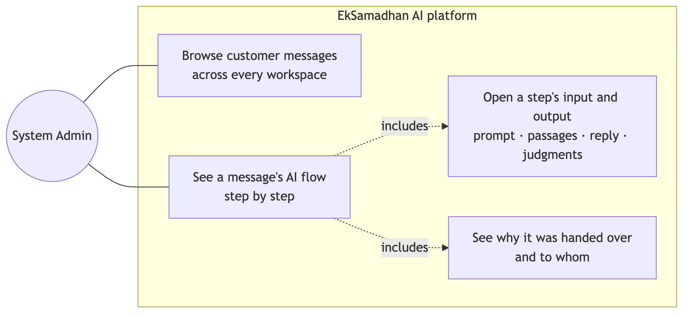
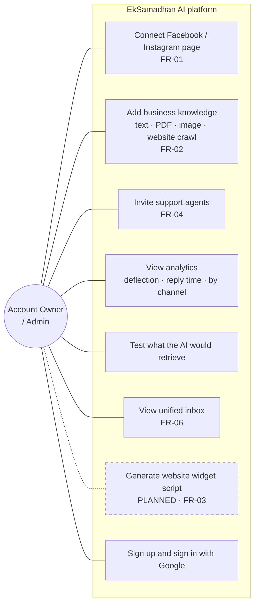
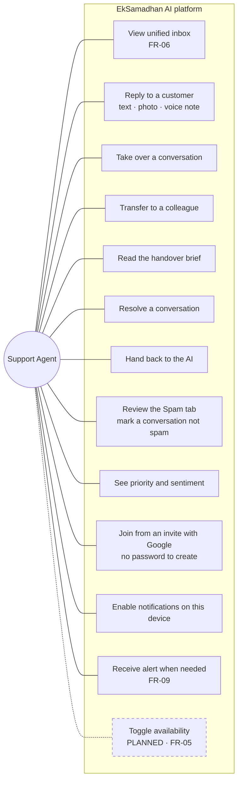
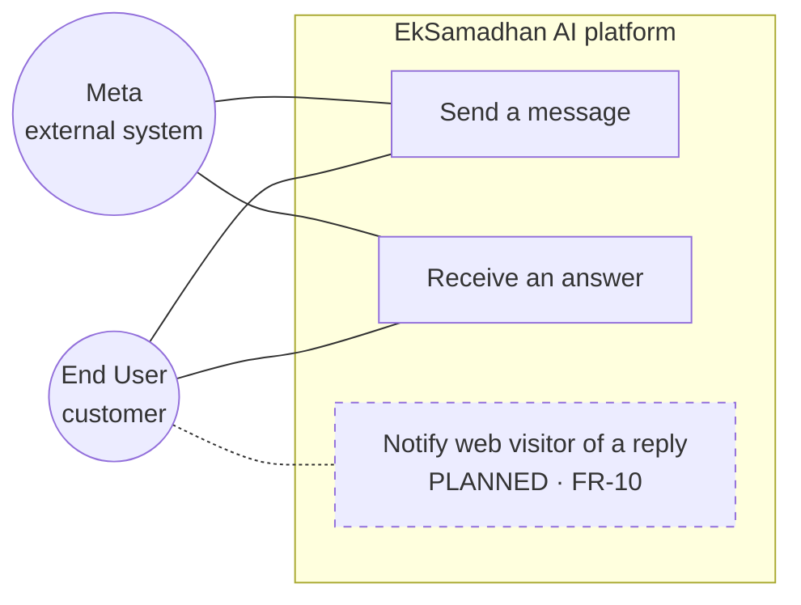
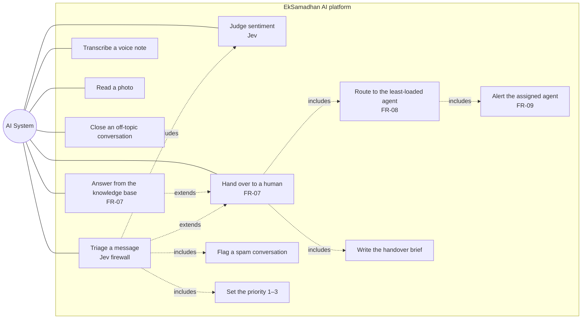
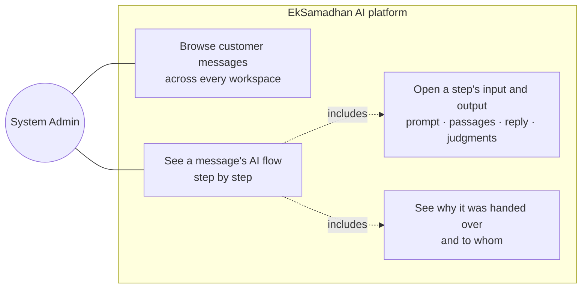

# Use case diagram — Semester 2

Compare with [Semester 1](../../old-system-design/use-case/Picture1.png), which had four
actors and eight use cases. Dashed items are designed but **not built**.

<!-- images -->

*Rendered from the Mermaid source below.*

Mermaid cannot lay out a classic UML use-case diagram, so the actors are split into five
views rather than crammed into one. Redrawn in Visual Paradigm they belong on a single canvas,
with these actors down the left and the ovals inside one system boundary.

### Account Owner / Admin

### Support Agent

### End User and Meta

### AI System

### System Admin

The platform operator, above the workspaces. Made only from configuration — no signup,
invitation or profile edit can create one — because this actor reads every workspace's
conversations.

## Requirement coverage

| ID | Requirement | State |
| :--- | :--- | :--- |
| FR-01 | Admin connects Facebook and Instagram pages | **Built** |
| FR-02 | Admin uploads knowledge about products and policies | **Built** — and extended to images and website crawling |
| FR-03 | Admin generates a chat widget script | Planned |
| FR-04 | Admin invites support agents by email | **Built** |
| FR-05 | Agent toggles availability | Planned |
| FR-06 | Agent views a unified inbox | **Built** |
| FR-07 | System detects low confidence and hands over | **Built** — three gates, not one |
| FR-08 | System routes a chat to a free agent | **Built** — least-loaded rather than round-robin |
| FR-09 | Agent receives a Web Push notification | **Built** |
| FR-10 | End user receives a push about a web-chat reply | Planned, depends on FR-03 |

## What changed from Semester 1

**Five actors, not four.** Meta is now drawn as an external system actor, because the platform
does not merely "have" social accounts — Meta delivers every inbound message, enforces a
24-hour reply window, and can stop delivering, which is a real dependency that the old diagram
hid inside one box labelled "Connect Social Accounts".

**The AI system does more than auto-reply.** Semester 1 gave it two use cases. It now
transcribes voice notes, reads photos, judges sentiment, writes the handover brief, picks the
agent to hand to, and closes conversations that are not about the business at all.

**"Toggle Availability" moved from built to planned.** It was implemented in Semester 1's
design and even appeared in the UI, but the control was removed because nothing consumed it —
routing considers every active member. It belongs back the moment routing respects it, which
is why it is drawn dashed rather than deleted.

**New cases the PRD never listed**, added because building the thing revealed the need:
transfer a conversation to a colleague, read the automatically-written handover brief, enable
notifications per device, view analytics, and test what the AI would retrieve for a question
before trusting it in front of customers.
