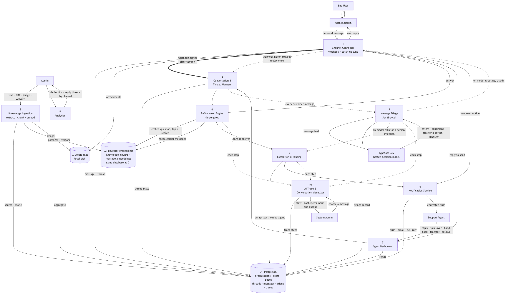
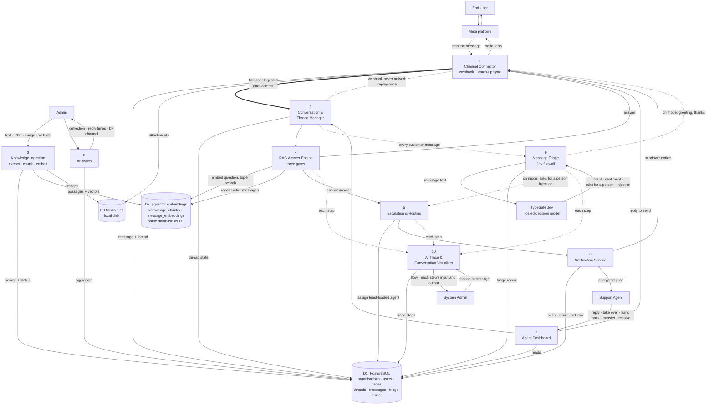

# Data flow diagram — level 1

The system opened up into ten processes and three data stores. Compare with
[Semester 1](../../../old-system-design/workflow-diagram/Level%201%20Data%20Flow%20Diagram/Picture1.png),
which had five processes and two stores.

<!-- images -->

*Rendered from the Mermaid source below.*

## The two flows Semester 1 had no equivalent of

### The commit boundary

Message ingestion publishes an event **inside** the database transaction, and every expensive
thing happens only **after that transaction commits**, on a different thread pool. It has to be
this way round. A worker thread cannot see rows the committing transaction has not released
yet — an earlier version called these services directly from the ingestion path, and they
looked for a message that did not exist and silently did nothing.

The **order inside the pool is also deliberate**: the customer's answer goes before sentiment
and embedding, because those are for us, not for them, and a local model serves one request at
a time. Notifying the owner comes first because it is not a model call at all.

That ordering is a question of *time*, not of data flow, so it is drawn where it belongs — in
the [sequence diagram](../../sequence-diagram/), which shows the same boundary as a divider
across the message's whole journey.

### The catch-up loop

The AI only ever ran from the live webhook. When a webhook was not delivered — the application
restarting, or Meta simply not sending — the message was stored later by the sync and then
answered by nobody. The conversation sat reading "AI is handling" indefinitely.

Every sync now looks for conversations still owed a reply and replays the customer's last
message down the same path, at most once per message. It is the dashed arrow from process 1
back into process 2.

One limit, stated plainly: the sync runs when the **dashboard** asks for it, every 10 seconds
while it is open. Nothing schedules it on the server, so with no dashboard open a message whose
webhook never arrived waits until someone opens one.

### The firewall in front of process 4

Process 9 puts a decision model before the generative one. The dotted flows are the ones that
only exist in `on` mode: settling a greeting or a thank-you without calling the model, and
sending a request for a person — or an attempt to steer the AI — straight to escalation. In
shadow mode, the default, process 9 still judges every message and records what it would have
done, but the flow runs through process 4 exactly as before. See
[`docs/jev-firewall.md`](../../../../jev-firewall.md) for the measured thresholds.

The catch-up loop also has a far edge now. Clearing test data does not clear Facebook, and the
sync would fetch the same conversations straight back; `SYNC_IGNORE_BEFORE` stops history older
than that moment being imported at all.

## What each process does

| # | Process | Responsibility |
| :--- | :--- | :--- |
| 1 | Channel Connector | Verifies webhook signatures, parses Meta payloads, de-duplicates redelivery, sends outbound messages, pulls history, and runs the catch-up pass |
| 2 | Conversation & Thread Manager | Finds or creates the thread, keeps its preview and unanswered count, and owns the status machine |
| 3 | Knowledge Ingestion | Extracts text from a paste, a PDF, an image description or a crawled page; splits it on headings; embeds each passage |
| 4 | RAG Answer Engine | Retrieval, prompt assembly with recalled conversation memory, the model call, and the three gates |
| 5 | Escalation & Routing | Moves the thread to a person, picks the least-loaded active agent, schedules the handover brief |
| 6 | Notification Service | One call writes the in-app bell row and sends the encrypted push; email is sent alongside on escalation |
| 7 | Agent Dashboard | Everything an agent does — reply, take over, hand back to the AI, transfer, resolve, read the brief |
| 8 | Analytics | Deflection against the 60% target, median and 90th-percentile reply times, escalation volume by channel |
| 10 | AI Trace & Conversation Visualizer | Writes every step processes 4, 5 and 9 take on a message — the Jev triage, the knowledge search, the model's exact prompt and raw reply, each gate, the escalation, the assignment, the alerts — with what went in and what came out. The system admin reads it back as a flow, across every workspace |
| 9 | Message Triage | One Jev decision per customer message — intent, sentiment, whether they are asking for a person, whether they are trying to steer the AI. In shadow mode (the default) it only records what it would do; in on mode it settles greetings, thanks and handovers before process 4 is ever called |

## The three gates on process 4

The Semester 1 design had one test: confidence below 70%. Three were needed.

1. **Retrieval similarity.** If nothing in the knowledge base comes close, the passages are
   dropped and the model answers without them, so a greeting is met conversationally rather
   than handed to a person.
2. **The model's own verdict.** It is asked whether the retrieved passages actually answer the
   question, and told that declining is a correct outcome. A passage can be *about* the right
   topic and still not contain the answer, and only reading it can tell.
3. **Confidence**, below which an answer is not sent.

A fourth signal sits beside them: whether the message is **related to the business at all**.
Without it, a question about a product the knowledge base does not cover was counted as
off-topic, and three of those closed the conversation as spam — on a real customer.

## Data stores

D1 and D2 are the **same PostgreSQL database**, drawn apart only because the vector columns
and their HNSW indexes are worth showing as a distinct concern. Semester 1 drew a separate
Pinecone store here; having one store is why deleting a knowledge source cannot leave its
vectors behind.
