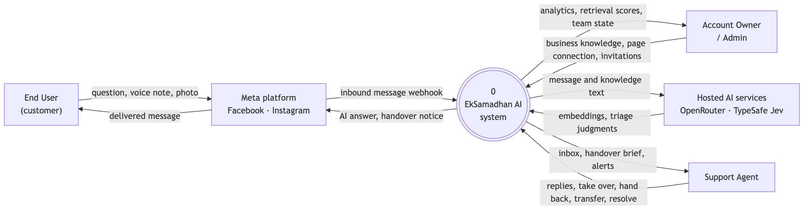
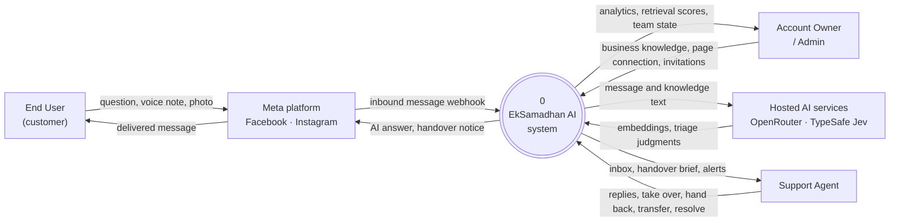

# Data flow diagram — level 0 (context)

The whole system as one process, with the four external entities that exchange data with it.
Compare with [Semester 1](../../../old-system-design/workflow-diagram/level-0-data-flow-diagram/Picture1.png).

<!-- images -->

*Rendered from the Mermaid source below.*

## Reading it against Semester 1

The old level 0 had three external entities — End User, Support Agent, Admin — talking
directly to the system box.

**Meta is now drawn as a fourth external entity, sitting between the customer and the
system.** That is not a cosmetic change. The system never receives a message from a customer:
it receives a webhook from Meta, and it never replies to a customer either — it asks Meta to
deliver. Everything that follows from that is real and was discovered by building it:

- Meta decides whether a message arrives at all. When a webhook is not delivered, the system
  finds the message later by polling, which is why the level 1 diagram has a catch-up flow.
- Meta enforces a 24-hour window for replying to a customer, so an answer written too late is
  refused.
- In development, Meta only delivers messages from accounts registered to the developer app,
  which is why testing requires a second account.

Drawing the customer as if they spoke to the system directly hides all three.

**Hosted AI services are a fifth external entity** — the one the original design never drew,
because it assumed nothing about where the model ran. The reply model runs on this machine,
but two things leave it: every message and knowledge passage is sent to **OpenRouter** to be
embedded, and every customer message is sent to **TypeSafe Jev** to be triaged. A context
diagram exists to show exactly what crosses the boundary, and customer text does — so it is
drawn, rather than letting "the model runs locally" suggest that nothing leaves. The old diagram
did, and that is exactly the class of detail a context diagram exists to expose.
