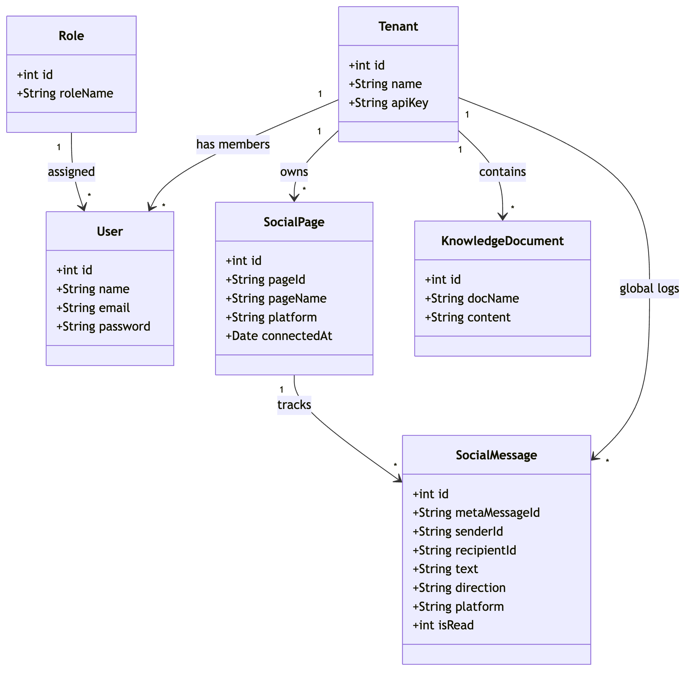
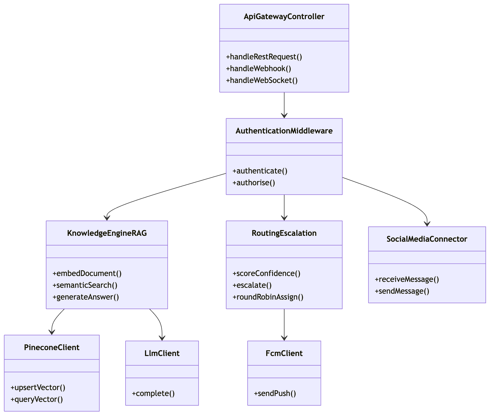
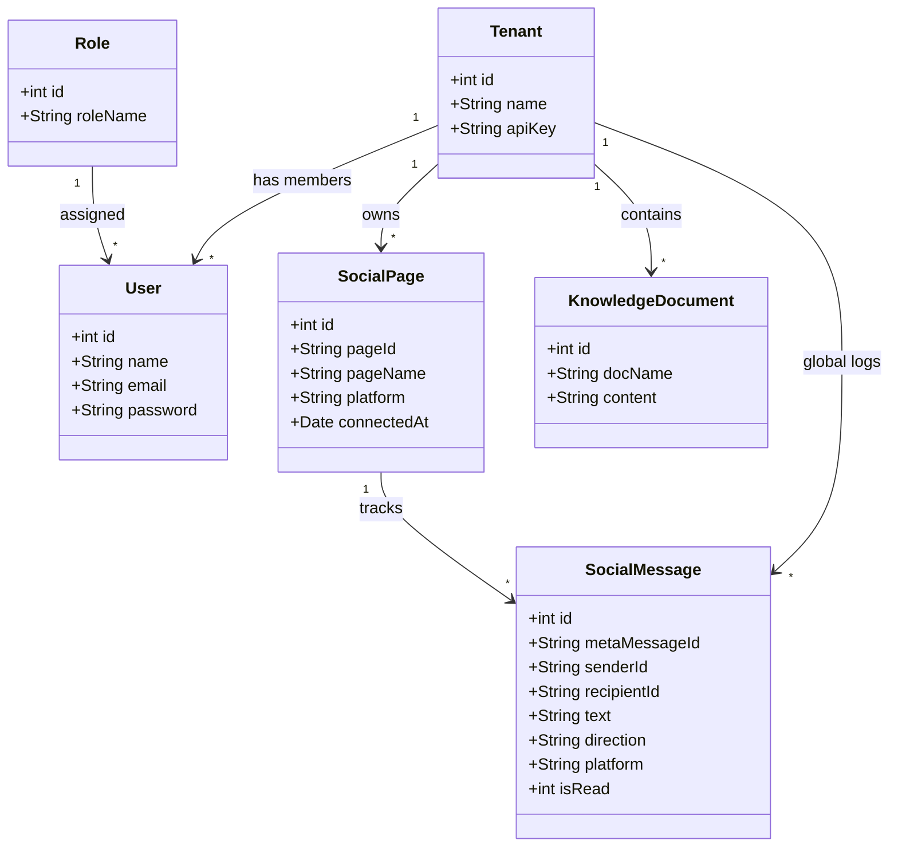
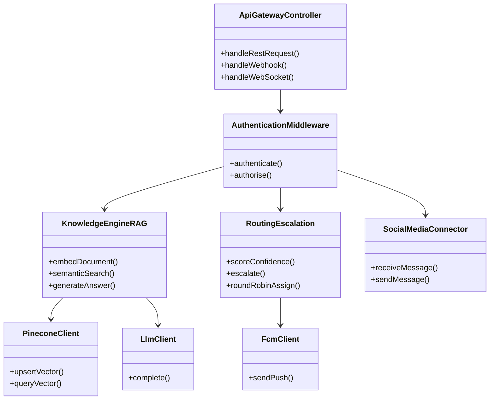

# Class diagram — Semester 1 (reconstructed)

> **This diagram is reconstructed, not recovered.** No class diagram was produced in
> Semester 1. This one is derived from that semester's
> [ER diagram](../er-diagram/Picture1.png) and
> [component diagram](../system-architecture/Picture1.png), and exists only so the Semester 2
> class diagram has something fair to be compared against. Everything in it is implied by
> those two documents; nothing is invented from the built code.

<!-- images -->

*Rendered from the Mermaid source below.*

## Domain model as designed in Semester 1

## Service components as designed in Semester 1

The component diagram named five backend blocks and four external dependencies. Drawn as
classes, the intended responsibilities were:

## What this reconstruction shows about the original design

Three things stand out once the Semester 1 model is drawn as classes, and all three changed
in Semester 2:

1. **There is no conversation.** Messages hang off a page and a tenant, with nothing between
   them. Nothing owns a conversation, nothing tracks its state, and there is therefore nowhere
   to record that the AI has handed it to a person. The whole handover feature has no home in
   this model.
2. **Roles are a table.** `Role` is a joined entity, which is the shape you use when roles are
   data an administrator edits. This project has exactly three fixed roles.
3. **Knowledge is one field.** `KnowledgeDocument.content` is a single `varchar(5000)` column.
   There are no passages and no vectors, so the retrieval the design depends on has nothing to
   retrieve from — the embeddings were assumed to live entirely inside Pinecone.

See [`../../new-system-design/class-diagram/`](../../new-system-design/class-diagram/) for
what was built, and
[`../../new-system-design/README.md`](../../new-system-design/README.md) for the full
comparison.
